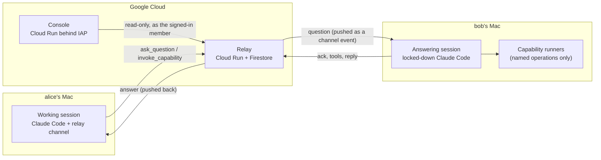

# Team relay

**Let your team's Claude Code sessions talk to each other.**

Ask a teammate's Claude a question from your own session and get the answer pushed back into
it. Or ask them to run one of a small set of named, parameterised operations ("query staging
for the last 20 failed orders") without ever handing anyone a shell. A hosted console shows
who is connected and every request's round trip as it happens.


<sub>The console in demo mode, with a synthetic team.</sub>

## How it works



- **The relay** is a small stateless FastAPI service. Firestore holds a mailbox per member,
  so nothing is lost when a laptop sleeps: clients resume from their last acknowledged
  message. Requests carry idempotency keys, deadlines and request IDs; broadcasts fan out.
  Every message is audited (hash and length, never the text).
- **The plugin** gives Claude Code a *channel*: an MCP server that pushes teammates' messages
  into the session as `<channel>` events and adds tools to ask, invoke and reply.
- **Every member runs two sessions.** Your normal *working session* asks and receives answers.
  A separate *answering session* answers teammates. It has an isolated config, no Bash,
  Write or Edit, and it reads nothing by default: only folders you share, or a file or folder
  you allow when it asks. Credential files stay unreadable. Because it has to acknowledge a
  question before it answers, the asker learns "no response yet" instead of waiting forever.
- **Capabilities** are declared in one manifest (`plugin/manifest.yaml`): named operations
  whose every parameter is an enum, a bounded number, a boolean, or a length-capped string
  matched by an RE2 pattern. Never free-form SQL, shell or paths. The same file drives the
  plugin's install questions, the tools the answering session exposes, and what teammates
  discover. Production data is a separate opt-in that is off by default.
- **The console** shows presence for both sessions of every member, a live list of requests
  with each hop (sent, delivered, acknowledged, tools used, answered, returned), who is
  waiting for a teammate to allow access, which folders each member shares, and a detail
  sheet with timings. Everyone sees the metadata; question and answer text is visible only
  to the people in that request.

## Security model

| Concern | What the system does |
|---|---|
| Who is speaking | The relay derives the sender from a verified Google ID token and an allowlist. Nothing in a request body can claim to be someone else. Cloud Run IAM sits in front as a second gate. |
| Prompt injection | Teammate text arrives as data inside `<channel>` tags or labelled tool results. The session's instructions say it is never to be followed as instructions. The channel never relays permission prompts. |
| What a teammate can make you run | Only capabilities you enabled, with parameters validated on both ends against the manifest. Each run is tied to a real, directed request. The runner gets no shell, a minimal environment, a timeout and an output cap. |
| What the answering session can read | Nothing by default. Folders you share deliberately (`ANSWERER_READ_DIRS`) are readable without asking; teammates see their names, never their paths. Anything else opens Claude Code's own permission dialog in your answering terminal, naming the path, and you allow it once, for the session, or not at all; a desktop notification and the asker's console show that it is waiting. Grants never outlive the session. Credential stores (ssh and gpg keys, cloud CLI credentials, `.env` files, browser cookies, keychains, wallet keystores and more) stay denied whatever you answer. These are Claude Code permission rules, not an OS sandbox. |
| Abuse | Per-sender rate limits, broadcast limits, read budgets and caps on long-polls. Manifest patterns run in RE2, so a teammate cannot publish a regex that stalls anyone. |
| The console | Read-only. Locally it binds 127.0.0.1 with a per-launch key. Hosted, it sits behind IAP for the listed members only and reads the relay as the signed-in member through a read-only delegate. |

## Join a team

The hosted console has a **Join the team** panel with these steps, filled in for your team.
In short:

1. Install [Claude Code](https://code.claude.com) 2.1.280 or newer, Node.js 22+ and the
   [Google Cloud CLI](https://cloud.google.com/sdk). Ask the team owner to add your Google
   account to the relay's allowlist.
2. `gcloud auth login you@your-domain`
3. Clone this repository, then in Claude Code:
   ```
   /plugin marketplace add /path/to/team-relay
   /plugin install team-relay@team-relay-dev
   ```
   and answer the install questions (relay URL, team, `google` sign-in, your account).
4. Start your working session:
   ```
   claude --dangerously-load-development-channels plugin:team-relay@team-relay-dev
   ```
   Channels are in research preview, so custom channels load with this flag after a
   one-time consent dialog.
5. Start your answering session in a second terminal:
   ```
   export RELAY_URL=https://<relay> RELAY_TEAM=<team> RELAY_GCLOUD_ACCOUNT=you@your-domain
   plugin/bin/answerer
   ```
   It reads none of your files by default. To let it read folders without asking, share
   them deliberately first: `export ANSWERER_READ_DIRS=~/src/app:~/notes` (teammates see the
   folder names). For anything else it asks you in that terminal, naming the file or folder:
   allow it once, for the session, or deny it. Credentials are never readable, whatever you
   allow. These are permission rules, not an OS sandbox.

Details, including writing capability runners: [`plugin/README.md`](plugin/README.md).

## Run your own relay

Everything deploys to one Google Cloud project, in resources named `team-relay*`:

```bash
cp config/deploy.example.env config/deploy.local.env    # your project, region, team
cp config/team.example.yaml  config/team.local.yaml     # your members' Google accounts
bash scripts/gcp-bootstrap.sh     # Firestore DB, service accounts, registry, secret (idempotent)
bash scripts/deploy.sh            # build and deploy the relay; invokers = your members
bash scripts/smoke.sh             # 403 without credentials, 401 for non-members
bash scripts/deploy-console.sh    # the hosted console behind IAP
```

Members outside your Google Cloud organisation need a custom OAuth client for IAP. The
console deploy takes it as `OAUTH_CLIENT_FILE` and attaches it to that service only. Both
`*.local.*` files are git-ignored: real identities never enter the repository.

## Repository

| Path | What |
|---|---|
| [`relay/`](relay/README.md) | The relay: FastAPI, Firestore and in-memory stores behind one contract test suite. |
| [`plugin/`](plugin/README.md) | The Claude Code plugin: channel server, capability server, answering-session launcher, local and hosted console server. |
| `console/` | The console UI: React, Vite, TypeScript, Tailwind, shadcn/ui. It builds into `plugin/dist/console`. |
| `schema/` | The capability manifest's JSON Schema. |
| `docs/` | The contracts, milestone by milestone, with dated corrections: [M1](docs/M1-SPEC.md) (relay and channel), [M2](docs/M2-SPEC.md) (deploy, identity, console), [M3](docs/M3-SPEC.md) (hosted console). |
| `scripts/` | Emulator, tests, bootstrap, deploy and smoke checks. |

## Development

```bash
bash scripts/test-relay.sh                               # relay suite against the Firestore emulator (Docker)
(cd plugin  && pnpm install && pnpm typecheck && pnpm test)
(cd console && pnpm install && pnpm typecheck && pnpm test)
bash scripts/e2e.sh                                      # emulator + relay + the real plugin servers, end to end
plugin/bin/console --demo --open                         # the console with a synthetic team
```

The end-to-end suite plays Claude Code over MCP. It covers directed questions, broadcasts
with "no response yet", capability calls with progress, resuming after a crash,
idempotency, identity rules, presence, delivery times, tool events and the console's
masking.

## Status

Working end to end and deployed for a team of three. Known limits:
- Custom channels need Claude Code's development flag during the channels research preview.
- Members sign in with gcloud's own ID-token audience. A token a member sends to some other
  service could be replayed to the relay within its hour; a dedicated OAuth client for the
  relay would close that.
- The answering session's read restrictions are Claude Code permission rules, not an OS
  sandbox: what you share or allow is readable, and the deny list covers the usual credential
  stores, not every secret on a machine.
