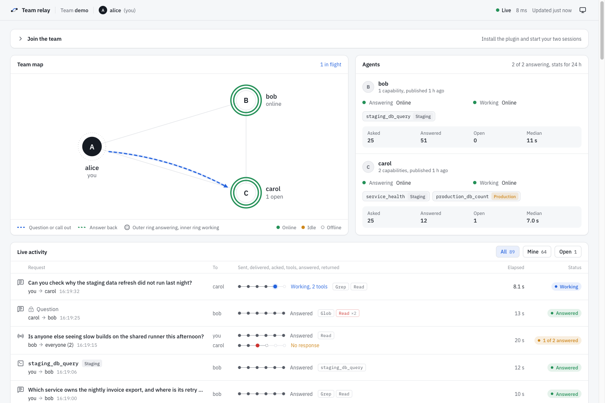
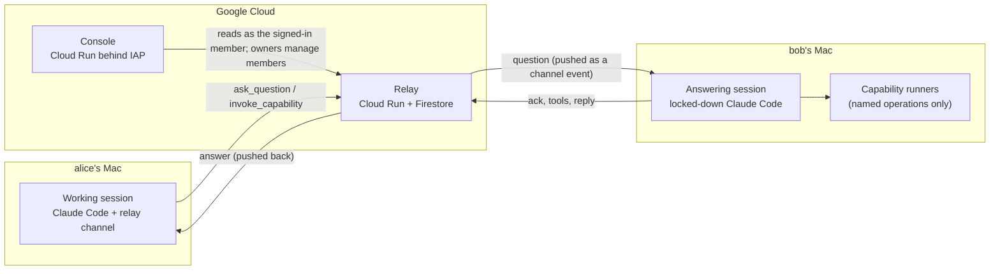

# Team relay

**Let your team's Claude Code sessions talk to each other.**

Ask a teammate's Claude a question from your own session and get the answer pushed back into
it. Or ask them to run one of a small set of named, parameterised operations ("query staging
for the last 20 failed orders") without ever handing anyone a shell. A hosted console shows
who is connected and every request's round trip as it happens.



<sub>The console in demo mode, with a synthetic team.</sub>

## How it works



- **The relay** is a small stateless FastAPI service. Firestore holds a mailbox per member,
  so nothing is lost when a laptop sleeps: clients resume from their last acknowledged
  message. Requests carry idempotency keys, deadlines and request IDs; broadcasts fan out.
  Every message is audited (hash and length, never the text).
- **The plugin** gives Claude Code a *channel*: an MCP server that pushes teammates' messages
  into the session as `<channel>` events and adds tools to ask, invoke and reply.
- **Every member runs two sessions.** Your normal *working session* asks and receives answers.
  A separate *answering session* answers teammates. It has an isolated config, no Bash,
  Write or Edit, and it reads nothing by default: only folders you share, or a file or folder
  you allow when it asks. Credential files stay unreadable. Because it has to acknowledge a
  question before it answers, the asker learns "no response yet" instead of waiting forever.
- **Capabilities** are declared in one manifest (`plugin/manifest.yaml`): named operations
  whose every parameter is an enum, a bounded number, a boolean, or a length-capped string
  matched by an RE2 pattern. Never free-form SQL, shell or paths. The same file drives the
  tools the answering session exposes, what teammates discover, and the settings
  `/team-relay:answering` lists. Production data is a separate opt-in that is off by default.
- **The console** shows presence for both sessions of every member, a live list of requests
  with each hop (sent, delivered, acknowledged, tools used, answered, returned), who is
  waiting for a teammate to allow access, which folders each member shares, and a detail
  sheet with timings. Everyone sees the metadata; question and answer text is visible only
  to the people in that request. Team owners add and remove members there, by Google email.

## Security model

| Concern | What the system does |
|---|---|
| Who is speaking | Each device signs in once with Google through the relay (`/team-relay:login`) and gets its own relay-issued credential, bound to one member of one team. The relay stores only its hash, expires it 90 days after last use, revokes it on logout or when the member is removed, and derives the sender from it. Nothing in a request body can claim to be someone else. The hosted console and gcloud users still use verified Google ID tokens. |
| Signing in | Loopback and PKCE, in the style of RFC 8252; no device codes, so there is no code to phish. The one-time code only ever goes to a listener on 127.0.0.1 on your own machine within 5 minutes, and is useless without the verifier the plugin holds; the listener answers anything but the right callback (wrong Host, path or state) with 404 and keeps waiting. The relay redirects nowhere else. Which relay you sign in to is never the model's choice: `/team-relay:login` takes no arguments (another relay comes only from `RELAY_URL` in your environment), and it never replaces a sign-in from a different relay. Signing out is `/team-relay:logout`, a command only you run, not a tool. After a sign-in the session says "Connected as <member> (<email>) on team <team>", and says plainly when that is a different member or team than before. The credential file is `~/.config/team-relay/credentials.json` (mode 600 in a mode-700 directory); the plugin refuses a file others could read. |
| Who is on the team | The roster lives in the relay. Owners add a member by Google email and remove them in the console; a removed member's devices stop working within 30 seconds. The relay is reachable without Cloud Run IAM (the sign-in pages must be) and authenticates every API call itself. |
| Prompt injection | Teammate text arrives as data inside `<channel>` tags or labelled tool results. The session's instructions say it is never to be followed as instructions. The channel never relays permission prompts. |
| What a teammate can make you run | Only capabilities you enabled, with parameters validated on both ends against the manifest. Each run is tied to a real, directed request. The runner gets no shell, a minimal environment, a timeout and an output cap. |
| What the answering session can read | Nothing by default. Folders you share deliberately (`ANSWERER_READ_DIRS`) are readable without asking; teammates see their names, never their paths. Anything else opens Claude Code's own permission dialog in your answering terminal, naming the path, and you allow it once, for the session, or not at all; a desktop notification and the asker's console show that it is waiting. Grants never outlive the session. Credential stores (the relay's own credential, ssh and gpg keys, cloud CLI credentials, `.env` files, browser cookies, keychains, wallet keystores and more) stay denied whatever you answer. These are Claude Code permission rules, not an OS sandbox. |
| Abuse | Per-sender rate limits, broadcast limits, read budgets, caps on long-polls, and rate limits on sign-ins and roster changes. Manifest patterns run in RE2, so a teammate cannot publish a regex that stalls anyone. |
| The console | Reads only, except an owner's roster changes (same-origin JSON requests only). Locally it binds 127.0.0.1 with a per-launch key. Hosted, it sits behind IAP; any signed-in Google account reaches the page, and the relay decides what it sees: a non-member gets "You're not on this team yet" and no data, not even the join details. |

## Join a team

You need [Claude Code](https://code.claude.com) 2.1.280 or newer and Node.js 22 or newer, and
the team owner must have added your Google email. Then, in Claude Code:

1. **Install the plugin.** No questions to answer.
   ```
   /plugin marketplace add <github-owner>/team-relay
   /plugin install team-relay@team-relay-dev
   ```
   `<github-owner>` is the account this repository lives under (the console's join panel
   shows your team's). While channels are in research preview, start Claude Code with
   `claude --dangerously-load-development-channels plugin:team-relay@team-relay-dev`
   (for a team on another relay than the plugin's default, put `RELAY_URL=https://<relay>`
   in front; the join panel shows the full command).
2. **Sign in:** `/team-relay:login`. Your browser opens on the relay; sign in with Google,
   pick the team, done. The session says "Connected as <you> (<your email>) on team <team>".
3. **Start answering:** `/team-relay:answering` prints the one command that starts your
   answering session; run it in a second terminal. It reads none of your files by default:
   put `ANSWERER_READ_DIRS=~/src/app:~/notes` in front to share folders (teammates see the
   folder names), and for anything else it asks you in that terminal. Credentials are never
   readable, whatever you allow.

`/team-relay:console` opens the console on your own machine; `/team-relay:logout` signs this
computer out (revokes its credential, then deletes it); `whoami` is a tool in your working
session. Details, including writing capability runners:
[`plugin/README.md`](plugin/README.md).

## Run your own relay

Everything deploys to one Google Cloud project, in resources named `team-relay*`:

1. **Configure.** `cp config/deploy.example.env config/deploy.local.env` (project, region,
   team) and `cp config/team.example.yaml config/team.local.yaml`: your team and its seed
   owner (a member id and a Google email). Everyone else is added in the console.
2. **An OAuth client for the sign-in.** In the Cloud Console create a *Web application* OAuth
   client with the redirect URI `https://<relay-host>/v1/login/callback`, and set the OAuth
   consent screen to *In production* (the scopes are only `openid` and `email`, so Google
   does not review it, and no test-user list is needed).
3. **Deploy.**
   ```bash
   OAUTH_CLIENT_FILE=~/Downloads/client_secret_....json \
     bash scripts/gcp-bootstrap.sh   # Firestore DB, service accounts, registry, secrets (idempotent)
   bash scripts/deploy.sh            # the relay (the app authenticates every call)
   bash scripts/smoke.sh             # 401 without credentials, 400 for a bare login start
   bash scripts/deploy-console.sh    # the hosted console behind IAP
   ```
4. **Invite.** Sign in as the seed owner, open the console's Members panel, add each
   teammate's Google email, and send them the three steps above.

The OAuth client's id and secret live only in Secret Manager. Both `*.local.*` files are
git-ignored: real identities never enter the repository. The plugin's default relay URL is
in `plugin/relay.default.json`; teams on another relay start Claude Code with
`RELAY_URL=https://<relay>` in front and then run `/team-relay:login`.

## Repository

| Path | What |
|---|---|
| [`relay/`](relay/README.md) | The relay: FastAPI, Firestore and in-memory stores behind one contract test suite. |
| [`plugin/`](plugin/README.md) | The Claude Code plugin: channel server, capability server, answering-session launcher, local and hosted console server. |
| `console/` | The console UI: React, Vite, TypeScript, Tailwind, shadcn/ui. It builds into `plugin/dist/console`. |
| `schema/` | The capability manifest's JSON Schema. |
| `docs/` | The contracts, milestone by milestone, with dated corrections: [M1](docs/M1-SPEC.md) (relay and channel), [M2](docs/M2-SPEC.md) (deploy, identity, console), [M3](docs/M3-SPEC.md) (hosted console), [M4](docs/M4-SPEC.md) (granted reads), [M5](docs/M5-SPEC.md) (install and sign in), [M6](docs/M6-SPEC.md) (members in the console). |
| `scripts/` | Emulator, tests, bootstrap, deploy and smoke checks. |

## Development

```bash
bash scripts/test-relay.sh                               # relay suite against the Firestore emulator (Docker)
(cd plugin  && pnpm install && pnpm typecheck && pnpm test)
(cd console && pnpm install && pnpm typecheck && pnpm test)
bash scripts/e2e.sh                                      # emulator + relay + the real plugin servers, end to end
plugin/bin/console --demo --open                         # the console with a synthetic team
```

The end-to-end suite plays Claude Code over MCP. It covers directed questions, broadcasts
with "no response yet", capability calls with progress, resuming after a crash,
idempotency, identity rules, presence, delivery times, tool events, the console's masking,
the whole sign-in against a fake Google, and an owner adding and removing a member.

## Status

Working end to end and deployed for a team of three. Known limits:
- Custom channels need Claude Code's development flag during the channels research preview.
- gcloud sign-in (`RELAY_AUTH=google`) still uses gcloud's own ID-token audience, so a token
  sent to some other service could be replayed to the relay within its hour. The device
  credential from `/team-relay:login` does not have this problem.
- The answering session's read restrictions are Claude Code permission rules, not an OS
  sandbox: what you share or allow is readable, and the deny list covers the usual credential
  stores, not every secret on a machine.
